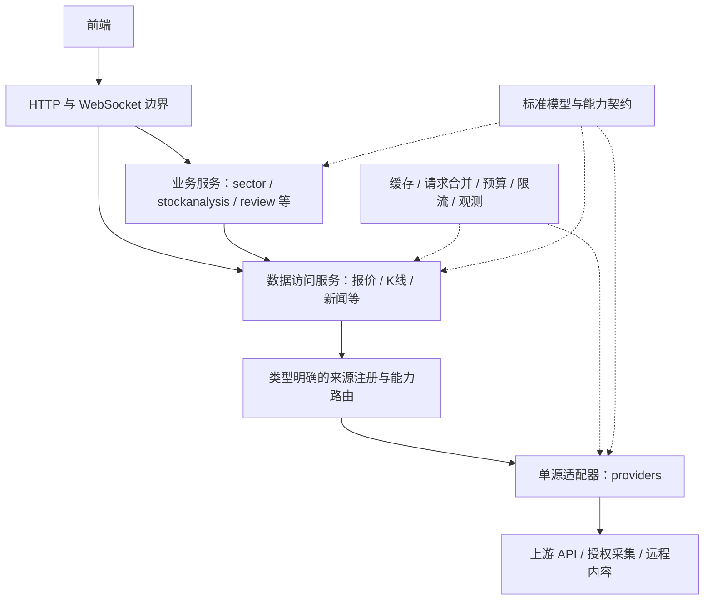

# 数据源抽象与接入架构改造方案

状态：架构基础、能力装配和主要消费链路已实施；供应商内部治理保留后续项。版本：1.2（2026-10-02）。基线：当前 main 工作树源码。

本方案配套 [改造清单](data-source-refactor-checklist.md)。实际模块职责见 [当前架构](../backend/docs/architecture.md)，默认取数规则见 [数据源与取数边界](../backend/docs/data-sources.md)。第 2 节记录迁移前的问题，第 5、7 节包含后续规范化目标；具体落地和未完成项以清单为准，不能把长期治理要求当作全部已经实现。

## 1. 目标与范围

按功能需要定义数据能力，由供应商适配器实现；业务只依赖标准能力接口。新增已有能力的供应商，改动收敛为“实现适配器、注册能力、配置路由、验证契约”，不要求修改页面、研究算法或 HTTP 处理器中的供应商分支。

“行情与证券数据”“资讯与研究内容”是产品管理分类，不是两个包揽所有方法的大接口。一个供应商可以实现多个小接口，不支持的能力不注册。新增一种此前没有的业务能力，仍需要扩展契约和相应业务。

首轮改造保持功能和现有选源行为，整理职责与依赖；供应商替换是后续独立工作。保留默认使用的七家公共来源，不新增 Token、付费依赖、Python 服务或尚未验证的上游。东方财富已退役的股票 K、明确复权、指数快照与历史不得重新进入主备路由。其余能力没有等价替代前继续保留，不通过删功能实现替换。

不建设动态插件加载、反射调用、通用 Fetch(kind, map[string]any)、策略 DSL 或未经证实的全市场统一题材字典。模型运行时不属于行情供应商；本次不重写交易算法，不删除历史报告、数据库、设置或登录态。

strategy/inflection/clickhouse.go 的 ClickHouseSource 是未接入默认 HTTP 装配的策略数据工具，本轮保留现状并明确排除于运行来源迁移；不将它登记成第八家已使用公共来源。以后启用回测取源时，单独制定回测数据契约，不将任意 SQL 查询扩展成公开通用取数接口。

## 2. 迁移前的耦合与处理基线

| 当前位置 | 已有基础或问题 | 目标处理 |
| --- | --- | --- |
| backend/internal/httpapi/config.go | 已有 RealtimeProvider、KLineProvider 等小接口，也有包含多种能力的 MarketOverviewProvider | 原始取数接口下沉到中立契约包；HTTP 可以保留面向页面的组合服务接口 |
| backend/internal/foundation/ | 已有 Quote、KLine、NewsItem、SourceMeta、BoardRef、字段可用性及价格错误 | 复用并逐步规范；不同时维护两套同义模型 |
| backend/internal/httpapi/server.go | 默认来源构造、业务组装、路由装配混在同一入口 | 提取集中装配函数，给 HTTP 注入数据访问服务与业务服务 |
| httpapi/kline_routing.go、kline_adjustment.go | 主备、预算、退避、供应商支持判断及部分标准化在 HTTP 内；严格复权绑定腾讯 | 标准化归适配器；能力选择和精确价格策略归数据访问服务；HTTP 保留参数兼容 |
| providers/marketoverview/provider.go | Primary 绑定行业、资金、融资、龙虎榜、公告、研报；回退和来源描述写死 | 拆原始能力；组合页面保留门面，来源策略从静态类型配置读取 |
| providers/hotstock/、providers/futuresposition/、providers/duanxianxia/limit_up_provider.go | 单源请求与多源并行、降级、合并位于同一模块 | 单源协议留适配器；取源编排与业务合并分离 |
| sector/radar*.go | 接口直接返回 duanxianxia.Snapshot/FetchMeta；融合身份和评分绑定开盘啦 | 标准题材快照作为输入，来源度量注明含义；融合算法继续由 sector 负责 |
| httpapi/source_health.go、source_probe.go | 固定来源名单、固定探针，观测依赖人工传来源名称 | 统一注册描述和探针，真实请求产生可归因的能力事件 |
| frontend/src/lib/source-integrations.ts | 来源目录与作用提示静态维护 | 逐步消费后端目录；保留兼容名称和失败显示策略 |
| review/、methodology/、hermes/ | 包含文章采集、归档、模型加工、知识同步等不同职责 | 取源能力可抽象，业务归档与模型加工不塞进供应商适配器 |

## 3. 目标架构与依赖

依赖规则：契约和 foundation 不依赖 HTTP、供应商或业务模块；providers 不依赖 sector、stockanalysis、review 的算法；数据访问服务可以依赖契约和治理组件，通过注入使用适配器；业务模块依赖契约或访问服务接口；装配入口可以认识具体实现。

目录已建立；runtime 本轮仅实现预算与取消，其它治理按下述规则渐进迁移：

~~~text
backend/internal/
  foundation/                  复用现有标准模型、身份和质量信息
  datasource/
    contracts/                 按能力划分的请求、小接口和结果契约
    registry/                  来源描述、类型明确的能力注册和探针注册
    runtime/                   请求预算与取消；后续治理组件的归属
    service/                   按能力的数据访问服务及路由策略
    assembly/                  默认构造与依赖装配；唯一集中认识全部实现的位置
  providers/<provider>/        单一供应商协议、分页、标准化与校验
  sector/                      题材、行业与成员的业务融合
  stockanalysis/               研究输入、证据、指标与报告
  review/                      订阅、归档、复盘加工与验证
  methodology/                 知识库、缓存与知识同步
  httpapi/                     参数、鉴权、兼容 DTO、HTTP/WS 生命周期
~~~

现有 providers 目录先复用，不为目录整齐一次性搬动所有文件。现有 HTTP Provider 接口在迁移期可通过别名或桥接委托，完成使用方迁移后再删除。最终业务计算不导入具体 providers 包；供应商来源可以作为证据展示，不用于识别某种实现类型来决定算法。

contracts 可以依赖 foundation，foundation 不反向依赖 contracts；registry 和 runtime 不依赖 service 或 assembly。assembly 只构造数据组件，不导入 httpapi 或业务模块，业务服务在现有启动装配位置接线，避免 Go 包循环。文章等中立输入也定义在 contracts/foundation，review.Post 等持久化业务实体通过业务转换生成，供应商不能因复用该实体而反向依赖 review。

assembly 返回中立的数据服务集合，不返回 httpapi.Config；cmd/server 或现有服务组合根把数据服务注入业务，再注入 HTTP。允许业务使用方在同包内定义更小的消费接口，但不得由数据层依赖该业务包来满足接口。

## 4. 能力清单与首轮行为基线

下表是需要制定契约的原始数据能力，不等于新增上游计划。页面级的 SectorMap、ThemeOverview、连板梯队和期指共识可以继续是组合业务服务。

| 能力 | 请求和标准结果要点 | 首轮保持的来源与边界 |
| --- | --- | --- |
| 个股报价与盘口 | 股票身份、批量股票、快照时间、价格、量额、五档及可用字段 | 新浪；不顺便新增腾讯报价备用 |
| 个股 K 线 | 标的类别、周期、数量、来源偏好、复权请求、实际价格基准 | 默认新浪 → 腾讯 none（已支持日周月）；明确 none/qfq/hfq 用腾讯，失败不混口径 |
| 当日分时与分钟样本 | 股票、日期、采样周期、覆盖范围及均价质量 | 新浪；五日图仍为五分钟采样，不冒充独立五日接口 |
| 按日历史分时 | 股票、交易日、月档案覆盖日期、逐点数据及昨收 | 新浪月档案，失败只按现有规则回退同日近期样本或同股同日旧缓存 |
| 集合竞价 | 股票、交易日、盘前参考轨迹 | 东方财富；参考价不是成交价，无独立备用 |
| 指数快照与历史 | canonical 指数身份、scope、日周月、原生时间 | 腾讯独立；缺项明确，不恢复东财；不支持分钟/年 K |
| 海外行业 ETF | ETF 标的与快照身份 | 腾讯现有美股行业 ETF；不扩充到完整海外行业覆盖 |
| 股票目录 | 代码名称、实际目录分类、缓存时间 | 默认东方财富；适配器实现能力与默认路由启用能力分开描述 |
| 分类与成员 | BoardRef、分页、总数、返回数、完整性、分类版本 | 腾讯原生行业；东方财富概念及映射补充；原生成员、目录候选、领涨股保持分组 |
| 行业强度 | 原始涨幅、量额/资金、字段质量与供应商度量 | 腾讯优先，东方财富有效字段回退；业务评分不由适配器统一伪造 |
| 题材快照与个股归因 | 题材身份、交易日、领涨股票、归因证据、快照版本 | 开盘啦；持久缓存和至少五分钟真实刷新闸门保留 |
| 涨停事件 | 股票＋交易日、板数、封板时间、开板次数、题材来源 | 开盘啦持久服务启用时与东财补充合并；无服务时东财；不是纯失败才备用 |
| 跌停与炸板 | 分开的事件池、交易日和覆盖范围 | 东方财富 |
| 平台人气榜 | 平台、榜单身份、排名、统计时点与缺失状态 | 同花顺、东方财富分别请求和展示；共识由业务计算 |
| 资金榜 | 个股/行业/概念维度、排序、资金定义、有效字段 | 新浪 → 东方财富；板块总净额不重标为主力净额 |
| 融资余额 | 日期序列、统计范围与单位 | 东方财富；不把现有融资余额扩写成完整两融能力 |
| 龙虎榜与席位 | 日期、股票、上榜原因、买卖明细和标签出处 | 东方财富榜单/明细；独立BillboardLabels路由补同花顺指定日期公开页标签；失败/禁用保留原明细，平台分类不等于资金身份确认 |
| 期指目录/历史/单日排名 | 分开描述合约目录、历史序列、单日会员排名 | 东方财富历史，中金所排名；单日降级不满足历史、价格、基差完整契约 |
| 公司资料与财务 | 主营/简介/行业/范围；报告期、累计指标定义与披露日期 | 新浪主源、东财显式整份备用；不跨源补字段，单期快照不等于历史PIT/连续改善 |
| 市场快讯 | 最新列表、标题/内容、链接、发布时间、标签 | 财联社；不是全历史资讯搜索接口 |
| 公告 | 列表查询、股票、类别、正文能力和内容状态 | 东方财富，正文尽力获取；正文失败不伪装全文成功 |
| 个股/行业研报 | kind、机构、评级、预测字段、标题/链接、内容范围 | 东方财富，现有列表字段不声明研报全文覆盖 |
| 复盘文章 | 来源、作者、原文、发布时间、正文、内容指纹 | 远程预整理内容；雪球/淘股吧授权浏览器；微信已知链接导入 |
| 知识文章 | 原文版本、内容、更新时点及出处 | GitHub 游资心法＋内置内容及缓存；不是实时市场事实源 |

年 K 聚合、技术指标、行情基线、市场情绪、连板晋级、题材评分、人气共识、复盘摘要和 AI 研究属于派生结果，不要求每家供应商实现它们。研究基准仍显式区分指数与股票身份，沿用现有腾讯映射和单位边界。

## 5. 标准数据契约

### 5.1 请求与结果

每种能力有类型明确的 Request 和数据类型；可以复用通用结果封装，但不能把所有数据都塞入 map。以下仅为接口形态示意，名称和细节在 P0/P1 落实，不是可直接编译的实现：

~~~go
type Result[T any] struct {
    Data   T
    Meta   ResultMeta
    Issues []DataIssue
}

type QuoteSource interface {
    Quotes(context.Context, QuoteRequest) (Result[[]foundation.Quote], error)
}

type KLineSource interface {
    SupportsKLine(KLineRequest) SupportDecision
    KLines(context.Context, KLineRequest) (Result[[]foundation.KLine], error)
}

type AnnouncementSource interface {
    Announcements(context.Context, AnnouncementRequest) (
        Result[[]foundation.MarketResearchItem], error,
    )
}
~~~

现有 Quote、KLine 等模型先复用。ResultMeta 表达整个结果的状态和贡献来源，行级字段质量和来源保留在各数据项内；不以列表字段交集覆盖个别行的真实能力。分页完整性、内容完整度等使用相应能力的结构，不给所有能力增加无意义字段。

每项能力明确必需字段、可选字段和空结果含义。公告或检索列表的有效空集可以表示“本次范围无匹配”，不能统一按上游故障重试；请求价格系列却无标的/系列属于 NoData。分页或正文缺失可以携带可用结果和 Issues；必须数据缺失、全部来源失败等则返回有类型错误，业务显式判断可用范围，不能只凭 error=nil 宣称完整。

### 5.2 身份与口径

- 标准证券身份包含类别、市场和代码；适配器内部负责转换新浪代码、腾讯代码及东财 secid。foundation/symbol.go 的供应商派生字段逐步退出业务使用，兼容入口分阶段保留。
- BoardRef 保留 provider、dimension、native_code、classification_version。同名分类不自动等价；跨源映射需要显式记录映射方法和可信度，无法确认时保留独立身份。
- 价格记录实际来源、requested/effective adjustment、adjustment convention、basis_id、单位和时区。整份 K 序列只能属于同一标的和价格基准；自动换源可以换完整序列，不能跨源补齐 OHLC。
- 明确复权的“支持能力”和“允许替换”分开判断。同为 qfq 不代表因子等价；指定来源不静默换源，历史时点复权 asof 仍拒绝直到有独立验证。
- 币种、金额、成交量和百分比含义由契约确定；指数原生量单位不推断为股票股数；日线日期标签不按宿主时区移日。

### 5.3 质量与证据

区分有效零、缺失、无数据、不支持、部分覆盖、陈旧和请求失败。迁移期复用 FieldsKnown/AvailableFields 与已有可空值；新适配器明确标字段状态，不借旧的“未标记即全部可用”兼容行为宣称能力。

保留 provider、source_url、published_at、captured_at/fetched_at、report_date、trade_date、time_status、cutoff 和内容范围。报告期不等于公告发布时间；采集时间不等于事件发生时间；搜索摘要不等于阅读全文。

多源补字段时保留行级/字段级出处和冲突记录。没有合并的字段可沿用整行来源；真正被补充的字段需可追溯供应商，不能只用 source=A+B 掩盖其出处。正文、摘要、列表元信息、截断正文分别声明内容范围，有限检索不证明无风险。

## 6. 注册、路由与新增供应商

### 6.1 类型明确的注册

来源描述包括稳定 SourceID、名称、管理类别、接入方式、已实现能力、默认路由启用范围、凭据要求/状态引用、用途说明、限流参数和代表探针。注册声明的能力必须有实现和契约验证，不能把预留字段当已接入。

Registry 分别维护报价、K 线、公告等类型明确的实现集合；可以提供 RegisterQuotes、RegisterKLines 等入口，不用 map[string]any 存实现后反射调用。能力目录与实现关联由注册过程校验，启动时检查重复 ID、缺实现和路由引用不存在的来源。

支持范围分为静态声明和具体请求判断：例如供应商声明股票 K，再判断本次股票市场、周期、复权是否支持。业务不调用 tencent.SupportsStockKLine 等静态函数，改由能力实现判断；判断不支持不会触发网络或供应商失败观测。

### 6.2 路由职责

每项能力有独立策略与允许来源列表：单源、精确指定、顺序主备、并行取独立结果。降级必须写明实际提供的范围，不能让单日能力冒充历史能力。注册适配器不自动加入任何默认路由，也不自动恢复退役来源。

输入需要的口径、字段和覆盖范围决定候选来源，优先级在满足条件后生效。能力级健康/退避只影响相关请求范围，不能因某接口故障禁用整个供应商。

涨停合并、主题融合、人气共识和期指排名共识不使用一个万能 merge 策略。数据访问层提供各源标准结果，业务组件按明确的身份、时点、字段优先级和冲突规则生成派生结果。

### 6.3 新增供应商的实际流程

1. 确认接入的已有能力及其语义，不能仅对照字段名。
2. 新建 providers/<provider> 适配器，只实现支持的接口；原始响应类型不外泄。
3. 添加脱网契约测试，覆盖单位、时间、身份、缺字段、空结果、错误与分页等。
4. 在 assembly 注册能力、描述、探针及必要配置状态引用。
5. 显式加入目标能力路由；独立榜单保持独立，不一律充当备用。
6. 通过组合与 HTTP 兼容验证，再按需显式做公网样本验证。

符合已有契约时无需新增 HTTP 处理器分支、前端来源数组或研究算法特判。新增业务能力、非等价口径或新的交互输入则需要单独变更契约和使用方；本方案不承诺任意上游零改动接入。

## 7. 请求治理、缓存与观测

### 7.1 请求过程

请求校验 → 解析路由/语义身份 → 查对应缓存 → 合并同键在途请求 → 过滤支持能力与退避状态 → 分配总预算 → 执行受限流保护的适配器 → 校验契约 → 记录实际尝试 → 写成功缓存 → 返回标准结果。

请求最后可按本能力策略返回同身份旧缓存并标陈旧；无数据和明确缺日是否允许旧缓存由能力决定，不把“所有失败统一返旧值”当公共默认规则。组合业务失败与上游请求故障分别记录。

访问策略还区分调用场景：详情轮询、普通 API、WebSocket、市场快照、研究证据和手动探测。场景由后端入口绑定，不由任意前端参数开启无限制强刷。保持现有调用差异：detail=1 的单股报价/分时采用详情缓存；普通批量报价和 WS 不自动套用五秒旧缓存；研究直接采集不改为使用 HTTP 页面旧快照，现有供应商内部缓存仍按原契约保留并标时间；手动探测走被指定来源的新请求。数据访问服务统一管理这些策略，但不通过 HTTP 自调用来服务后端业务。

### 7.2 机制集中，规则分开

| 治理项 | 设计要求 |
| --- | --- |
| 超时/重试 | 总请求预算包含各次重试和回退；不层层重置完整时限；取消传递到上游 |
| 限流 | 按来源配置共享上游访问限制；开盘啦持久五分钟闸门继续跨重启有效，不能变为只有内存限制 |
| 失败分类 | Unsupported、NoData、InvalidData、RateLimited、Transport/Upstream、AuthRequired、Cancelled 等有明确语义，适配器保留原因链 |
| 熔断/退避 | 服务故障按来源＋能力及必要市场/周期范围隔离；标的无数据/字段无效仅标的级；取消不计失败 |
| 请求合并 | 同一规范请求复用在途操作；一个查看者取消不取消其他查看者；最后一个退出再取消底层请求 |
| 缓存 | 按能力选择时效、容量和旧值规则，读取复制或使用不可变数据，避免返回数据被共享修改 |
| 主动探测 | 直达被检测来源，不走跨源回退或旧业务缓存；仍遵守必要访问限制，限流跳过不伪报成功 |

缓存不能统一成一个 TTL 或一个最大化 key。价格键包含标的类别/身份、周期、数量/日期、来源/路由版本和复权基准；成员键包含 BoardRef、分类/快照版本及分页条件；内容键包含来源、原文 ID/URL、查询/分页和内容范围；融合缓存包含规则版本与输入快照身份。登录采集还需隔离配置/会话范围，但键和日志不得包含原始凭据。

首轮保持现有时效：市场模块 45 秒、报价与单日分时至少 5 秒、目录 6 小时、人气榜 2 分钟、开盘啦至少 5 分钟真实刷新；普通日周月 K 不新增统一服务器旧快照兜底。后续调整单列行为变更，不随架构迁移顺便修改。

此处五秒规则限于现有详情访问路径；上述场景的缓存身份、最大可接受数据年龄、陈旧许可和是否刷新必须在 P0 分别冻结。主源/备用适配器缓存与合成结果缓存各自有唯一所有者，兼容包装不再加一层等效重试或缓存。公开 K 的默认口径请求键与指定来源/复权键隔离，备用实际来源的缓存不能满足严格请求；切换路由版本后不得误读旧策略结果。

自动选源的请求缓存键使用请求语义、调用场景、来源偏好/路由版本，不要求先访问上游取得实际 basis_id 才能查缓存；缓存值保存实际供应商、有效复权和价格基准，读取时校验它仍满足本次策略。供应商级缓存使用已知原生请求身份和精确系列键。source-default 不能被规范成 none，即使某次默认路由实际使用腾讯 none，两类请求仍独立表达。

### 7.3 观测与来源目录

实际请求生成 AttemptEvent：来源、能力、必要请求范围、尝试时间、耗时、错误分类、结果质量。事件单独进入观测组件，不依靠拼接 source 字符串猜故障，也不把运行事件持久写入研究证据。

适配器/治理边界的实际上游调用是观测唯一写入点；一次网络尝试只有一个标识，重试各自记录、逻辑请求另有聚合状态。同键合并的多个等待者只消费结果，不重复记录尝试。迁移该能力时关闭原 HTTP/组合 Provider 的重复健康写入；供应商内部缓存命中通过明确状态传递，不凭本次调用返回成功就生成新的上游观测。

观测区分 TransportAttempt 与 CapabilityOutcome：HTTP 200 不证明业务解析成功，网络重试成功也不直接覆盖整项能力状态。能力最终结果在响应解析、契约校验后记录；本地持久化错误另归存储/业务故障，不重标为上游故障。事件可以通过注入的 recorder 汇集，供已有 sources DTO 做兼容投影。

保留的适配器内部缓存与共享请求使用中立执行状态表达 Attempted、FromCache、Joined、Skipped 和 next_allowed_at。新浪历史分时月缓存命中不新增请求成功；开盘啦一次刷新涉及题材和涨停池时，分别记录真实能力结果，不只记录入口能力。网络/能力事件只在真正 fetch 的所有者产生，等待者与取旧快照的调用方不再补记。

手动探测绕过业务旧缓存与跨源回退，但不虚构突破访问限制后的成功。五分钟业务刷新闸门不自动扩大为现有独立直达探针的限制；若某采集模式确实受持久闸门约束，未尝试必须返回明确 Skipped/RateLimited 和可再次请求时间，不能返回旧值作为本轮检测成功。

业务观测、手动探测、缓存命中三个状态分开。缓存读取不更新 last_success/checked_at；探针成功不抹去另一能力的失败；服务重启、记录过期规则保持当前语义。标的诊断有容量与有效期限制，不将全量股票历史塞进设置接口。

GET /sources 继续只读，POST /sources/check 继续显式主动检测。目录描述先通过兼容的新增字段提供，再迁移 SourceIntegrationCatalog、SourceHealthPanel 和 sourceName；旧 SourceID、source 前缀、历史名称维持可解释。前端可保留小型历史别名表，但已实现能力和默认启用范围不继续双份维护。

注册目录可以覆盖多类来源，但默认公共来源计数仍是当前七家；模型运行时、浏览器授权采集、微信链接服务、远程复盘、知识内容分别分组，不因统一目录扩大公共来源检测范围。

## 8. 业务融合与内容边界

| 业务 | 数据层输出 | 业务层保留的职责 |
| --- | --- | --- |
| 行业/题材 | 原始行业度量、题材快照、归因、成员与价格 | 题材衰减、行业题材映射、强度计算、趋势排名、成员分组 |
| 连板/情绪 | 各源涨停记录、跌停/炸板池、历史量价 | 按股票＋交易日合并、字段冲突、梯队与晋级、情绪评分 |
| 人气 | 各平台有时点和范围的独立榜单 | 共识、交集、差异解释；不将平台排名直接相加 |
| 期指 | 主力目录、历史序列、单日会员排名 | 单日降级展示、会员共识；不制造缺失价格或基差 |
| 个股研究 | 标准量价、公司资料、公告、研报、快讯等 | 按研究级别采集、证据截断与归档、cutoff、计算、引用、AI 报告与验证 |
| 复盘 | 作者列表、文章列表/正文、已授权页面结果 | 订阅、去重、作者删除标记、SQLite 归档、摘要与次日验证 |
| 知识 | GitHub/内置文章及版本 | 本地缓存、库索引、Hermes 技能/知识同步 |

复盘适配器可以采用 browser_session、link_import、remote_feed 等模式。雪球/淘股吧保留用户授权的内置浏览器会话采集；微信只承诺现有已知链接导入，不以接口抽象名义恢复不可用自动订阅。远程每日复盘是预整理 JSON 内容，不能重标为客户端直接采集原站。

AuthRequired 表示当前采集需要配置/登录，不作为全源公共接口故障。registry 只返回配置就绪状态和配置引用，密钥、Cookie、Token 和浏览器存储仍由 appsettings/desktop/Hermes 既有安全路径管理，不进入目录响应、日志或仓库。

AI 联网检索得到的链接/摘要保留检索证据性质，模型结论另标为加工结果；不把模型记忆或生成文本注册为原始事实供应商。数据层抽象不吞并模型进程、对话会话和复盘任务的生命周期。

## 9. 迁移、兼容与交付切分

具体任务编号、依赖、文件和验证范围见 [改造清单](data-source-refactor-checklist.md)。以下阶段有顺序依赖，各阶段内部可按不同文件并行。

实施覆盖所有消费入口，包括普通/详情 HTTP、WebSocket、研究及验证、持仓巡检、明日预期、复盘验证和后台情绪采集。各阶段结束对残余 Provider 直调做静态审计：仅允许兼容委托、单源适配器内部取数和明确排除的未启用工具；不能只迁移页面接口而留下后台业务绕过新服务。入口、任务与回归场景对应关系见清单中的覆盖矩阵。

| 阶段 | 交付 | 进入下一阶段的条件 |
| --- | --- | --- |
| P0 | 行为基线、能力请求/结果与身份契约 | 当前选源、失败、缓存、质量和历史证据规则都有可核对基线 |
| P1 | registry、装配入口、目录/探针观测及财联社快讯试点 | 首个端到端路径只依赖能力；默认名单与手动检测语义兼容 |
| P2 | 报价、K、分时、竞价、指数的数据访问服务 | HTTP 不再负责供应商判断；复权、单位、预算、取消、同日缓存及退役约束通过验证 |
| P3 | 拆行情总览原始能力、人气/期指单源实现、公司资料和财务 | 小接口可独立替换；原有主备、并行和单日降级行为保持 |
| P4 | 涨停合并和题材/成员业务解耦 | sector 不依赖开盘啦原始模型；原生身份和字段来源可追溯；评分含义保持 |
| P5 | 内容取源边界、研究/复盘/知识集成与清理 | 使用方不绕过访问策略；无重复目录/治理；历史数据兼容且文档同步 |

迁移期新服务通过桥接委托进入原有 HTTP/WS，保持参数、返回 JSON、来源标识、渐进事件顺序和刷新交互。新契约不直接强制前端使用新 envelope；HTTP DTO 负责兼容投影。新增字段先兼容增加，需要改字段语义时单独制定 API 版本/前端迁移，不静默重解释旧字段。

每个能力完成新路径验证后再切换默认构造。回滚通过该阶段代码提交或装配开关恢复旧委托，不双写、不删除用户数据。可逆切换不得指向已退役东财价格接口。持久缓存/快照若需升级，使用独立版本或兼容读取；首轮优先避免破坏性 schema 迁移和改写历史 source/basis。

不进行真实网络双跑来对比所有路径，避免增加上游访问与限流；以脱网样本和模拟上游对照行为，必要公网验证单独显式启用、记录实际结果。测试用独立数据路径，不覆盖已安装桌面用户库。

## 10. 验收标准与验证计划

### 架构验收

- 原始取数接口按能力拆分；新增现有能力适配器可以通过实现、注册、路由配置接入。
- 业务模块不导入具体供应商包，不判断供应商实现类型或原生代码前缀来发请求。
- HTTP 处理器只做参数、鉴权、生命周期和 DTO 兼容；来源实现、路由策略与业务融合各有明确归属。
- registry 的描述、实际实现、路由启用能力和代表探针一致，前端不再人工复制当前来源清单。

### 行为验收

- 主备、并行独立、合并补字段和能力降级与本方案基线一致；价格不跨源拼接，严格复权不偷偷换口径。
- 缺失与真实零、金额量单位、未知时区、成员完整性、内容范围在 UI、排序评分和 AI 输入中一致。
- 无数据/不支持/取消不污染整源健康；缓存不续期，探测和业务记录互不覆盖。
- 请求预算、重试、取消、同键合并、并发读写和持久刷新闸门没有回归。
- 旧 API、来源别名、研究报告、作者/订阅、缓存快照和本机配置可继续使用。
- 实现与配置不放宽 loopback、Token、Origin 和用户数据隔离边界。

### 计划执行的检查

各阶段先执行受影响包和场景测试；跨前后端变更运行对应测试与构建；桌面采集/桥接变化才加桌面测试。具体阶段重点在清单中列出。

~~~text
# backend/ 下，最终后端回归
go test ./...

# 根目录下，涉及前端时
npm --workspace frontend test -- --run
npm run build:frontend

# 根目录下，涉及桌面桥接/采集时
npm --workspace desktop test
~~~

并发治理发生变化时，对相关包进行支持环境下的 Go race 检查，前提不满足则明确记录未执行。公网样本与 Windows 布局回归为按变更范围显式执行的额外检查，不把列表中的命令写成已经通过。

方案整理阶段仅核对源码与文档；实施阶段已执行的回归及未执行检查见配套清单的实施记录，不确认上游实时可用性。

## 11. 文档维护

方案记录约束，清单记录已完成与后续任务；backend/docs/data-sources.md 记录当前运行事实；docs/source-replacement-rollout.md 记录供应商替换范围和证据。架构迁移后同步 backend/docs/architecture.md、受影响 API/专题文档和 AGENTS.md 的实际入口，不提前把拟建目录写成已经实现。

## 12. 设计审核结论

主审结合两名独立审阅成员完成架构可实施性、消费入口覆盖和兼容评审，并在修正后再次复核。版本 1.1 未留有已识别但未关闭的设计阻断，可按配套任务清单实施。

审核覆盖：现有来源/能力与源码一致性；包依赖及适配器/访问服务/业务分工；多源语义、复权、原生身份与质量；不同调用场景的缓存、总预算、取消、唯一观测及内部副刷新；HTTP/WS/研究/复盘/持仓/知识消费路径；阶段依赖、验收计划、历史数据兼容和可逆回滚。文档链接、任务编号和引用另作静态检查。

版本 1.2 已建立 contracts/registry/runtime/service/assembly，并接回市场和内容消费链路。默认来源不变；新增适配器仍需注册、配置能力路由及契约验收。遗留错误的全量分类、统一网络事件、全局治理及评分角色字段进一步清理未在本轮全部完成，详见清单。设计评审与离线回归不等于公网供应商长期可用性保证。

实施交叉审核已修复供应商取消、未启用能力的健康归属、详情报价观测、知识缓存来源隔离及题材原生码冲突。个股研究改用中立归因角色并兼容历史标签；当前默认评分行为保持。
